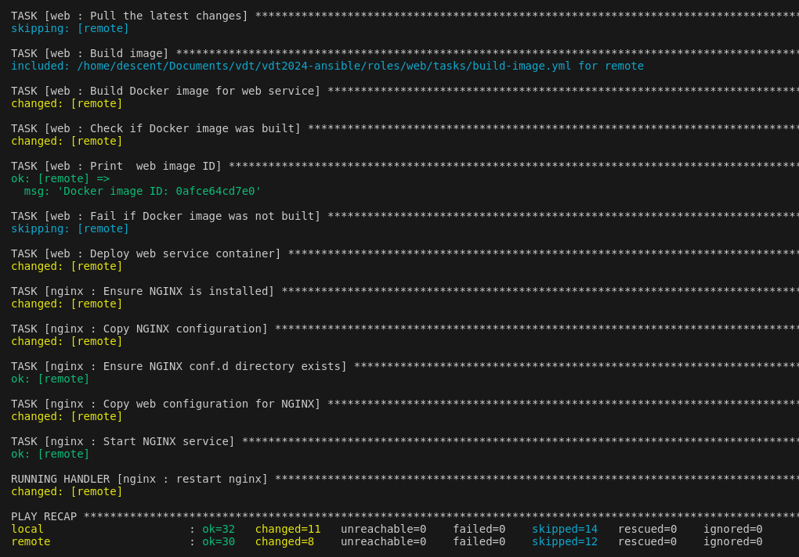
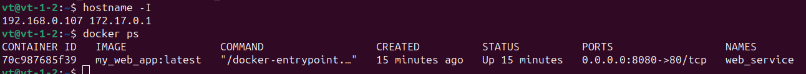
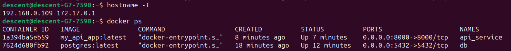

# Ansible playbooks to deploy docker images of web services, api, db

# Table of contents
## [I. Ansible là gì ?](#1-overview)
-   ### [1. Ansible](#11--what-is-ansible)

## [II. Bài làm](#2-homework)

-   ### [1. Install ansible](#21-install-ansible)
-   ### [2. Config](#22-configure)
-   ### [2. Deploy](#23-deployment)

## [III. References](#4-references)

# 1. Overview
### 1.1 . Ansible là gì ?

- Ansible là một công cụ cung cấp phần mềm nguồn mở, quản lý cấu hình và triển khai ứng dụng cho phép cơ sở hạ tầng dưới dạng mã. Nó chạy trên nhiều hệ thống giống Unix và có thể cấu hình cả hệ thống giống Unix cũng như Microsoft Windows. Nó bao gồm ngôn ngữ khai báo riêng để mô tả cấu hình hệ thống. Ansible không có tác nhân, tạm thời kết nối từ xa thông qua SSH hoặc Windows Remote Management (cho phép thực thi PowerShell từ xa) để thực hiện các nhiệm vụ của nó.

- Ansible Playbooks sử dụng YAML, đây là một ngôn ngữ dễ đọc bằng tiếng Anh đơn giản so với hầu hết các ngôn ngữ kịch bản. Với Ansible, bạn có khả năng quản lý tệp kiểm kê văn bản thuần túy của các máy chủ mà bạn muốn theo dõi hoặc sửa đổi. Các máy chủ này có thể được nhóm lại với nhau hoặc riêng biệt dưới các tiêu đề nhóm khác nhau. Khi xây dựng Ansible Playbook, bạn có thể phân biệt nhóm nào sẽ chạy mô-đun nào.

# 2. Bài làm

- Thiết lập docker cho môi trường mục tiêu  với vai trò “common”

- Chia ứng dụng thành 3 vai trò: “web”, “api” và “db”

## 2.1 Install Ansible:
```shell
sudo apt-get install software-properties-common

sudo apt-add-repository --yes --update ppa:ansible/ansible

sudo apt-get install ansible
```
## 2.2 Configure 

File `inventories/inventory.ini` được chia thành các nhóm máy chủ. Mỗi nhóm có thể chứa một hoặc nhiều máy chủ với các thuộc tính cụ thể. Trong trường hợp này, có ba nhóm máy chủ: all_hosts, webserver, và apiserver.
```ini
[all_hosts] 
remote ansible_ssh_host=192.168.0.107 ansible_user=vt ansible_become=yes 
local ansible_ssh_host=192.168.0.109 ansible_user=descent ansible_become=yes

[webserver] 
remote

[apiserver]
local
```

File `playbook.yml` bao gồm ba phần chính:
1. Cài đặt Docker trên tất cả các máy chủ. 
2. Triển khai API và cơ sở dữ liệu trên máy chủ cục bộ (localhost).
3. Triển khai ứng dụng web và cấu hình NGINX trên máy chủ từ xa (remotehost).
```yml
---
- name: Install Docker
  hosts: all_hosts
  become: true
  vars:
    docker_sdk_for_python_install: true  # Biến xác định rằng Docker SDK cho Python sẽ được cài đặt
    docker_compose_install: true         # Biến xác định rằng Docker Compose sẽ được cài đặt
  roles:
    - common

- name: Deploy API and Database on localhost
  hosts: apiserver
  become: yes
  vars:
    sync_repo: true  # Biến xác định rằng repository sẽ được đồng bộ (pull hoặc clone)
  vars_files:
    - vault.yml  # File chứa các biến mật (secret variables)
  roles:
    - api
    - db

- name: Deploy Web Application and Configure NGINX on remotehost
  hosts: webserver
  become: yes
  vars:
    sync_repo: false  # Biến xác định rằng repository sẽ không được đồng bộ (pull hoặc clone)
  vars_files:
    - vault.yml  # File chứa các biến mật (secret variables)
  roles:
    - web
    - nginx
```

Trong dự án này, các thành phần được khai báo theo từng vai trò của nó. Ở đây, bao gồm các role `common` sẽ thiết lập `docker`, `nginx` sẽ thiết lập `web server` bằng nginx, `db` sẽ cài đặt `postgresql` và api sẽ là `api`.  
Cấu Trúc Thư Mục Cơ Bản của Một role:
```markdown
roles/
├── <role_name>/
│ ├── tasks/
│ │     └── main.yml
│ ├── handlers/
│ │     └── main.yml
│ ├── templates/
│ ├── files/
│ ├── vars/
│ │     └── main.yml
│ ├── defaults/
│ │     └── main.yml
│ └── meta/
│       └── main.yml
```

- **`tasks/main.yml`**: Chứa các tác vụ chính.
- **`handlers/main.yml`**: Chứa các handlers.
- **`templates/`**: Chứa các file template.
- **`files/`**: Chứa các file tĩnh.
- **`vars/main.yml`**: Chứa các biến của role.
- **`defaults/main.yml`**: Chứa các biến mặc định của role.
- **`meta/main.yml`**: Chứa metadata của role.

## 2.3 Deployment
Command:   
```bash
ansible-playbook playbook.yml --ask-vault-pass
```
*or* 
 ```bash
 ansible-playbook playbook.yml --vault-password-file vault_password.txt
 ```
Output: 
<div align="center">
  
</div>
<div align="center">
  
</div>
<div align="center">
  
</div>

# 4. References:
- [Ansible](https://www.ansible.com/)
- [Triển khai ứng dụng Docker Compose với Ansible và GitHub Actions](https://medium.com/swlh/deploying-docker-compose-applications-with-ansible-and-github-actions-7f1740392507)
- [Cách cài đặt Docker Compose bằng Ansible Playbook](https://cloudinfrastructureservices.co.uk/how-to-install-docker-compose-using-ansible-playbook/)
- [Tự động hóa việc triển khai Docker của bạn với Ansible - YouTube](https://www.youtube.com/watch?v=CQk9AOPh5pw)
